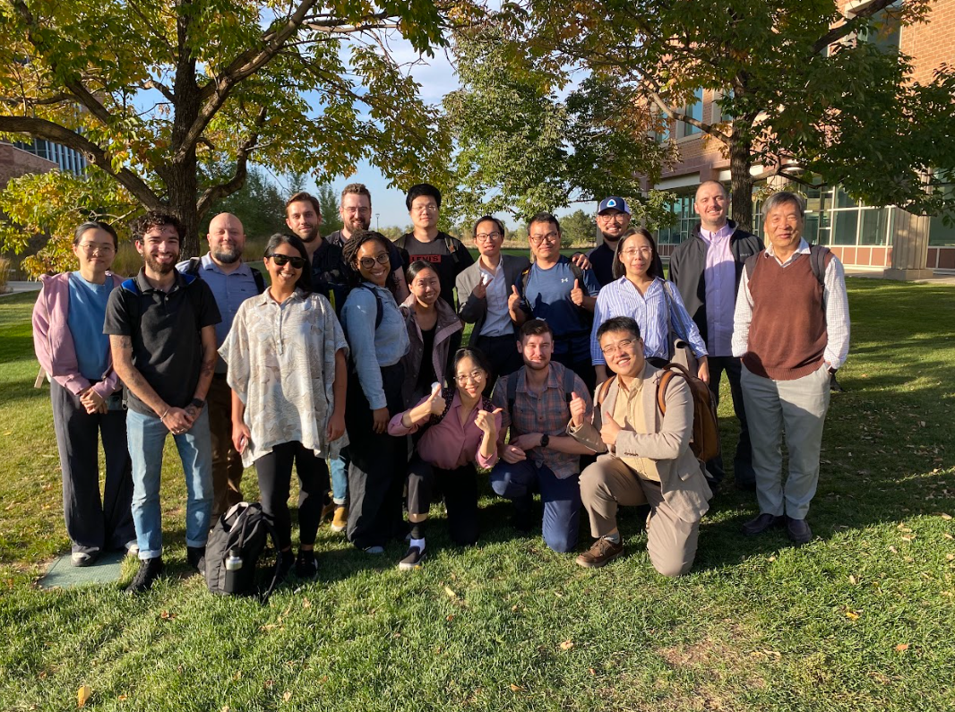

 
# [ESIIL AI for Natural Methane Working Group (AI4NM)]

Welcome to the AI for Natural Methane Working Group (AI4NM) repository, an integral part of the Environmental Data Science Innovation and Inclusion Lab (ESIIL). This repository is the central hub for our working group, encompassing our project overview, proposals, team member information, codebase, and more.

## Our Project
- Atmospheric methane (CH4) grew at the fastest rate ever recorded in 2020-2022. Slowing or reversing the accelerating growth in atmospheric CH4 will require an improved understanding of the global CH4 budget. Natural CH4 emissions are responsible for ~40% of the total global CH4 budget but remain the most uncertain factor. 
- Our working group aims to build a novel Knowledge-Guided Machine Learning (KGML) framework that integrates scientific knowledge from process-based models and machine learning to harmonize simulated and observed datasets from global wetlands and soil sinks.

## Documentation
- Access detailed documentation on our [GitHub Pages site](https://cu-esiil.github.io/AI-for-Natural-Methane/).
- Find comprehensive guides, tutorials, and additional resources.

## Project Poster
[<https://drive.google.com/file/d/16X5Xw-yC25NDlBHGlQiNzXGygjl5bGMY/view>]

## Group Members
Youmi Oh, Licheng Liu, Sparkle Malone, Gavin McNicol, Kyle Arndt, Lori Bruhwiler, Shuo Chen, Zichong Chen, Bradley Gay, Alison Hoyt, Sara Knox, Fa Li, Avni Malhotra, Stefan Metzger, Kendalynn Morris, Colin Quinn, Kevin Rozmiarek, Chris Smith, Eric Ward, Jennifer Watts, Yi Yang, Qing Ying, Michael Yonker, Fenghui Yuan, Kunxiaojia Yuan, Jianqiu Zheng, Qing Zhu, and Qianlai Zhuang 
- Our affiliation can be found: <https://docs.google.com/spreadsheets/d/1xVoMTReT30rbvdaD4w0QPra3FjtPc4I5zj12ZM48NB0/edit?usp=sharing>  
    
Photos from our Workshop in Oct 2024
  
## Repository Structure
- **Analysis Code**: Scripts for data analysis, statistical modeling, etc.
- **Data Processing**: Scripts for cleaning, merging, and managing datasets.
- **Visualization**: Code for creating figures, charts, and interactive visualizations.

## Meeting Notes and Agendas
- Regular updates to keep all group members informed and engaged with the project's progress and direction.

## Contributing to This Repository
- Contributions from all group members are welcome.
- Please adhere to these guidelines:
  - Ensure commits have clear and concise messages.
  - Document major changes in the meeting notes.
  - Review and merge changes through pull requests for oversight.

## Getting Help
- If you encounter any issues or have questions, please refer to the [ESIIL Support Page](https://esiil-support-page-url/) or contact the repository maintainers directly.

