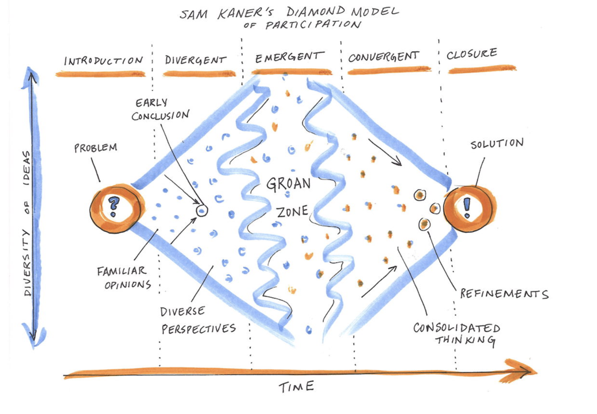
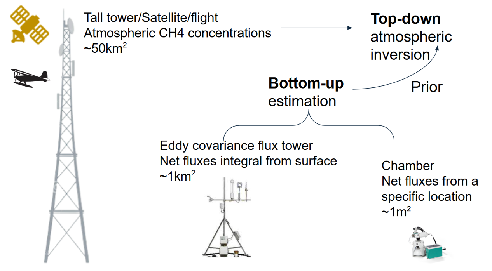

 

# AI for Natural Methane: Community Effort to Harmonize Natural Methane Datasets using Knowledge Guided Machine Learning

Welcome to the "AI for Natural Methane" repository, part of the Environmental Data Science Innovation and Inclusion Lab (ESIIL). This repository serves as the central hub for our working group, hosting our project description, proposals, member bios, codebase, and more. 

## Working Group Members
Youmi Oh, Licheng Liu, Sparkle Malone, Gavin McNicol, Kyle Arndt, Lori Bruhwiler, Shuo Chen, Zichong Chen, Bradley Gay, Alison Hoyt, Sara Knox, Fa Li, Avni Malhotra, Stefan Metzger, Kendalynn Morris, Colin Quinn, Kevin Rozmiarek, Chris Smith, Eric Ward, Jennifer Watts, Yi Yang, Qing Ying, Michael Yonker, Fenghui Yuan, Kunxiaojia Yuan, Jianqiu Zheng, Qing Zhu, and Qianlai Zhuang 
- Our affiliation can be found: <https://docs.google.com/spreadsheets/d/1HALS0Iwz_ofEZ-cD7weIxUQ2Cgdbg2ufR8O3ADrjv5U/edit?gid=0#gid=0>  
   
Photos from our Workshop in Oct 2024
  
## Motivation of Our Project

- Atmospheric methane (CH4) grew at the fastest rate ever recorded in 2020-2022. Slowing or reversing the accelerating growth in atmospheric CH4 will require an improved understanding of the global CH4 budget. Natural CH4 emissions are responsible for ~40% of the total global CH4 budget but remain the most uncertain factor.  
- **Our working group aims to build a novel Knowledge-Guided Machine Learning (KGML) framework that integrates scientific knowledge from process-based models and machine learning to harmonize simulated and observed datasets from global wetlands and soil sinks.**
  

## Goal of our Working Group
 
- The objective of this working group is to synthesize multiple measured and simulated datasets using a KGML framework to better constrain natural CH4 fluxes from wetlands and soil sinks. 
- This KGML framework will be designed to integrate scientific knowledge from bottom-up and top-down models, machine learning models and multi-source data through knowledge-guided architecture pretraining and training. 
- Specifically, we will harmonize the following four types of natural CH4 datasets within the KGML framework; We will use the bottom-up and top-down estimates of natural CH4 sources and sinks to pretrain the model. We then use observation data from chamber and FLUXNET-CH4 measurements to fine-tune the model.
  

## Progress on our first in-person workshop in October, 2024
Our first in-person workshop was held from October 2 to 4, 2024 at ESIIL in Boulder, CO. We had an enthusiastic group of 23 in-person team members and 7 virtual members join the workshop.
  
**[Overarching goals]** 
- **1. Harmonize Natural Methane Dataset**: We worked on harmonizing field-based methane fluxes from chamber and eddy-covariance measurements, natural methane fluxes simulated from top-down atmospheric inversions constrained by atmospheric observations, and simulated methane fluxes from bottom-up process-based models. We collected our first set of natural methane datasets during this workshop.
  
- **2. Identify Knowledge and Gaps**: We aim to identify the current state of knowledge regarding the community’s understanding of natural methane sources and sinks, uncertainties in natural methane data and models, and how to harmonize different forms of data and models for knowledge-guided machine learning (KGML).
  
- **3. KGML Tutorial**: Dr. Licheng Liu led the great tutorial on how to run KGML for carbon quantification based on Liu et al. (2024).
  

**[Outcome of the workshop]** 
- We are working on 2 perspective papers (led by Shuo Chen and Kevin Rozmiarek) on (1) Pushing the Frontiers in Natural Biogenic Methane Modeling and Monitoring with Machine Learning (*Chen et al., in prep*) and (2) Ethics in AI/ML for the carbon cycle (*Rozmiarek et al., in prep*).

   
We navigated several challenges to progress through the groan zone and anticipate more ahead!
  

## Our Ongoing projects, papers, and sub-Working Groups

- **Harmonized Data Product**: 
We are working to generate and publicly share harmonized measured/simulated datasets and monthly global natural methane flux products from KGML at 0.5-degree resolution from 1980 to present. *The first version of data is submitted to KDD 2025 Benchmarks Track in February, 2025.*  
   

- **Data & code archive and visualization**
We collected the multi-source datasets and products on CyVerse and will archive the final product on the ESS-DIVE.
We will use our WG github to share all relevant codes and documentation, together with a Docker container (packaged codes and environment) for KGML.
The gridded final product from KGML will be visualized and/or accessible in public platform such as Mapbox (Example) or Google Earth Engine.

- **Ongoing sub-working groups**
Perspectives on KGML4CH4 
Global budget and trends, regional patterns 
Disturbance ecology- ex. Fire, Disease, Salinity
Sources and sinks - ex. Microbial processes
  
… and more to come!
  

## Code Repository: <https://github.com/CU-ESIIL/AI-for-Natural-Methane>
  
## Contributing to This Repository

We welcome contributions from all group members. To maintain the quality and integrity of the repository, please adhere to the following guidelines:

- Make sure all commits have a clear and concise message.
- Document any major changes or decisions in the meeting notes.
- Review and merge changes through pull requests to ensure oversight.
