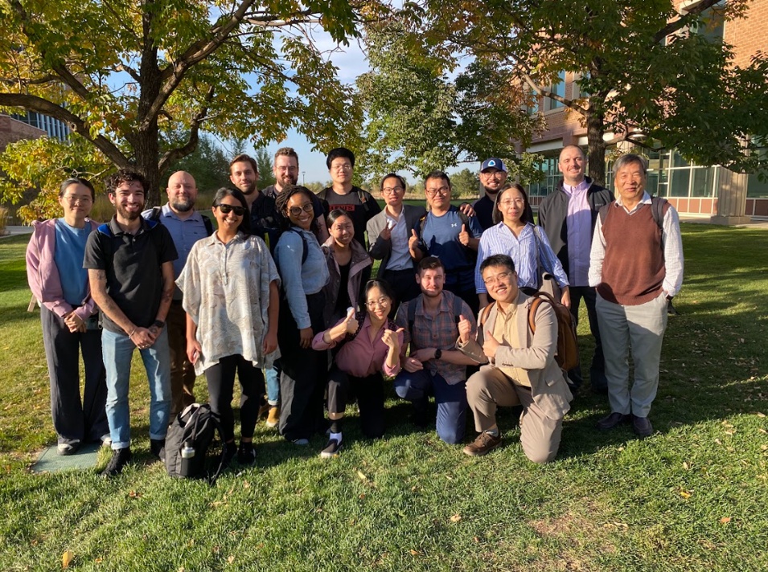
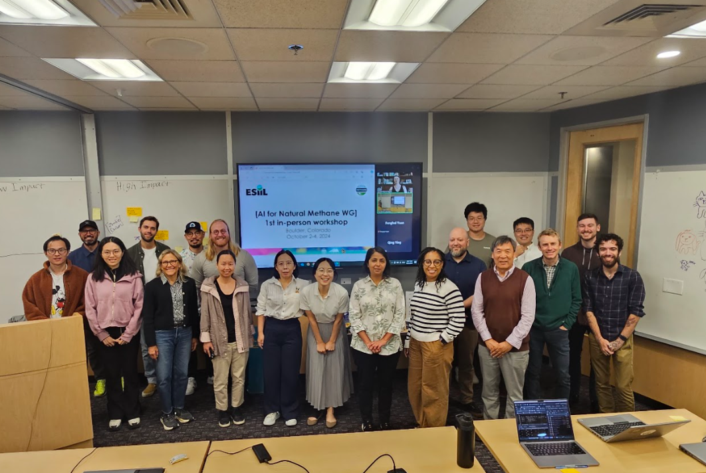
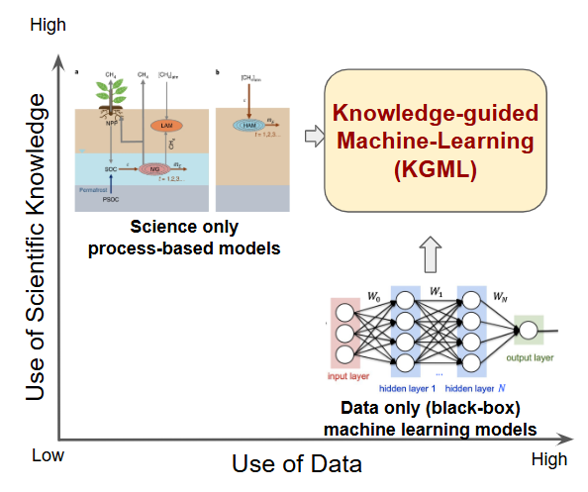
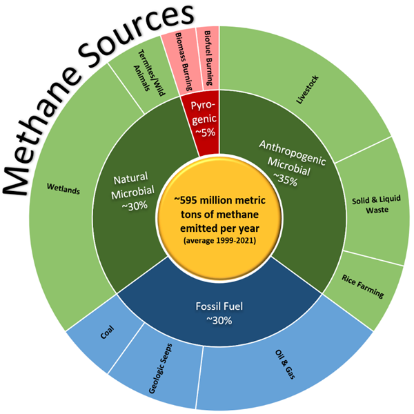
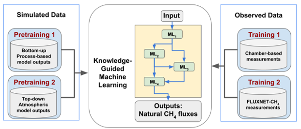

 

# AI for Natural Methane: Community Effort to Harmonize Natural Methane Datasets using Knowledge Guided Machine Learning

Welcome to the "AI for Natural Methane" repository, part of the Environmental Data Science Innovation and Inclusion Lab (ESIIL). This repository serves as the central hub for our working group, hosting our project description, proposals, member bios, codebase, and more. 

## Working Group Members
Youmi Oh, Licheng Liu, Sparkle Malone, Gavin McNicol, Kyle Arndt, Lori Bruhwiler, Shuo Chen, Zichong Chen, Bradley Gay, Alison Hoyt, Sara Knox, Fa Li, Avni Malhotra, Stefan Metzger, Kendalynn Morris, Colin Quinn, Kevin Rozmiarek, Chris Smith, Eric Ward, Jennifer Watts, Yi Yang, Qing Ying, Michael Yonker, Fenghui Yuan, Kunxiaojia Yuan, Jianqiu Zheng, Qing Zhu, and Qianlai Zhuang 
- Our affiliation can be found: <https://docs.google.com/spreadsheets/d/1HALS0Iwz_ofEZ-cD7weIxUQ2Cgdbg2ufR8O3ADrjv5U/edit?gid=0#gid=0>  
   
Photos from our Workshop in Oct 2024
  
## Motivation of Our Project

- Atmospheric methane (CH4) grew at the fastest rate ever recorded in 2020-2022. Slowing or reversing the accelerating growth in atmospheric CH4 will require an improved understanding of the global CH4 budget. Natural CH4 emissions are responsible for ~40% of the total global CH4 budget but remain the most uncertain factor.  
- **Our working group aims to build a novel Knowledge-Guided Machine Learning (KGML) framework that integrates scientific knowledge from process-based models and machine learning to harmonize simulated and observed datasets from global wetlands and soil sinks.**
  

## Goal of our Working Group
 
- The objective of this working group is to synthesize multiple measured and simulated datasets using a KGML framework to better constrain natural CH4 fluxes from wetlands and soil sinks. 
- This KGML framework will be designed to integrate scientific knowledge from bottom-up and top-down models, machine learning models and multi-source data through knowledge-guided architecture pretraining and training. 
- Specifically, we will harmonize the following four types of natural CH4 datasets within the KGML framework; We will use the bottom-up and top-down estimates of natural CH4 sources and sinks to pretrain the model. We then use observation data from chamber and FLUXNET-CH4 measurements to fine-tune the model.
 <be>

## Code Repository: <https://github.com/CU-ESIIL/AI-for-Natural-Methane>
  
## Contributing to This Repository

We welcome contributions from all group members. To maintain the quality and integrity of the repository, please adhere to the following guidelines:

- Make sure all commits have a clear and concise message.
- Document any major changes or decisions in the meeting notes.
- Review and merge changes through pull requests to ensure oversight.
