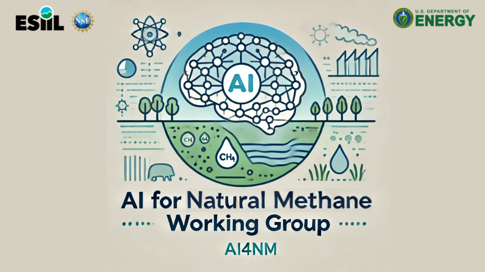

 

# AI for Natural Methane: Community Effort to Harmonize Natural Methane Datasets using Knowledge Guided Machine Learning

Welcome to the "AI for Natural Methane" repository, part of the Environmental Data Science Innovation and Inclusion Lab (ESIIL). This repository serves as the central hub for our working group, hosting our project description, proposals, member bios, codebase, and more. 

## Current Working Group Members
Youmi Oh, Licheng Liu, Sparkle Malone, Gavin McNicol, Kyle Arndt, Lori Bruhwiler, Shuo Chen, Zichong Chen, Bradley Gay, Alison Hoyt, Sara Knox, Fa Li, Avni Malhotra, Stefan Metzger, Kendalynn Morris, Colin Quinn, Kevin Rozmiarek, Chris Smith, Eric Ward, Jennifer Watts, Yi Yang, Qing Ying, Michael Yonker, Fenghui Yuan, Kunxiaojia Yuan, Jianqiu Zheng, Qing Zhu, and Qianlai Zhuang 
- Our affiliation can be found: <https://docs.google.com/spreadsheets/d/1HALS0Iwz_ofEZ-cD7weIxUQ2Cgdbg2ufR8O3ADrjv5U/edit?gid=0#gid=0>

## Our Project

Harmonizing Natural Methane Datasets using Knowledge-Guided Machine Learning

Atmospheric methane (CH4) is the second most powerful greenhouse gas after carbon dioxide and grew at the fastest rate ever recorded in 2020-2022. Slowing or reversing the accelerating growth in atmospheric CH4 will require an improved understanding of the global CH4 budget, which is currently underconstrained. Natural CH4 budgets are responsible for ~40% of the total global CH4 budgets but remain the most uncertain factor. This AI for natural CH4 working group aims to build a novel framework that integrates scientific knowledge and machine learning to harmonize simulated and observed datasets from global wetlands and soil sinks to quantify the spatial and temporal changes of global natural CH4 fluxes. Specifically, we will harmonize every possible form of the global natural CH4 datasets, including field-based CH4 fluxes from chamber and eddy-covariance measurements and simulated CH4 fluxes from bottom-up process-based models and top-down atmospheric assimilation models. As an output of this working group, we will generate and publicly share harmonized measurement datasets and global natural CH4 flux products from 1980 to present.

## Project Poster:[https://drive.google.com/file/d/16X5Xw-yC25NDlBHGlQiNzXGygjl5bGMY/view]

## Principal Investigators

- **Member 1**: Youmi Oh, University of Colorado Boulder, PI
- **Member 2**: Sparkle Malone, Yale University, Co-PI
- **Member 3**: Gavin McNicol, University of Illinois Chicago, Co-PI
- **Member 4**: Licheng Liu, University of Minnesota, Co-PI, tech lead
  
- **Working Group Members: <https://docs.google.com/spreadsheets/d/1HALS0Iwz_ofEZ-cD7weIxUQ2Cgdbg2ufR8O3ADrjv5U/edit?gid=0#gid=0>

## Code Repository: <https://github.com/CU-ESIIL/AI-for-Natural-Methane>

## Meeting Notes and Agendas

Meeting notes and agendas will be regularly updated here to keep all group members informed and engaged with the progress and direction of the project.

## Contributing to This Repository

We welcome contributions from all group members. To maintain the quality and integrity of the repository, please adhere to the following guidelines:

- Make sure all commits have a clear and concise message.
- Document any major changes or decisions in the meeting notes.
- Review and merge changes through pull requests to ensure oversight.
