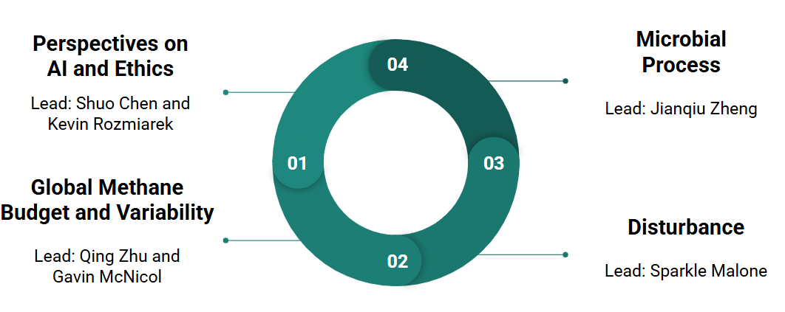

# Our Ongoing Sub-Working Groups
1. **Perspectives on AI and Ethics** led by Shuo Chen and Kevin Rozmiarek. 
2. **Global Methane Budget and Variability** led by Qing Zhu and Gavin McNicol.   
3. **Disturbance** led by Sparkle Malone. 
4. **Microbial Process** led by Jianqiu Zheng. 

 
 
