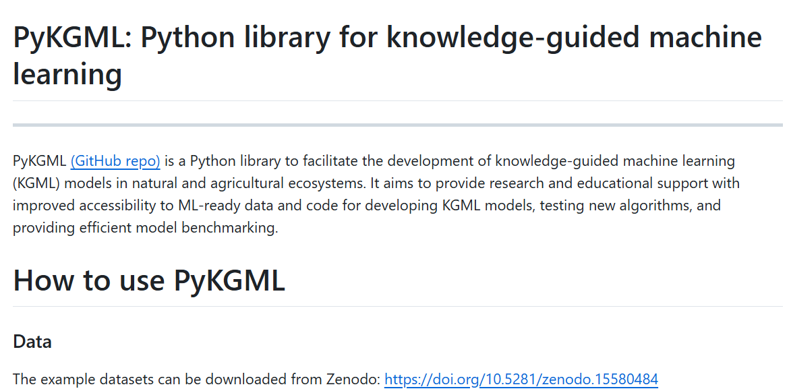

# PyKGML: Python library for knowledge-guided machine learning: 
PyKGML (GitHub repo) is a Python library to facilitate the development of knowledge-guided machine learning (KGML) models in natural and agricultural ecosystems (based on Liu et al. 2024). It aims to provide research and educational support with improved accessibility to ML-ready data and code for developing KGML models, testing new algorithms, and providing efficient model benchmarking.
 <be>
**https://github.com/AI4Agriculture/PyKGML_development**

 .
 .
